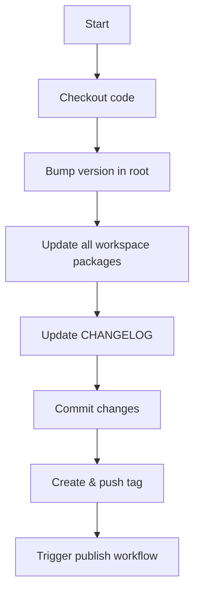

# GitHub Actions Automation Guide

This repository includes automated workflows for testing, versioning, and publishing to npm.

## 📋 Table of Contents

- [Setup Requirements](#setup-requirements)
- [Available Workflows](#available-workflows)
- [Publishing Workflow](#publishing-workflow)
- [Version Bump Workflow](#version-bump-workflow)
- [Testing Workflow](#testing-workflow)
- [Troubleshooting](#troubleshooting)

## 🔧 Setup Requirements

### 1. Configure npm Token

You need to add your npm automation token to GitHub Secrets:

1. Go to `https://github.com/abhinav-18max/pr-visual-diff/settings/secrets/actions`
2. Click "New repository secret"
3. Name: `NPM_TOKEN`
4. Value: Your npm automation token (from `~/.npmrc`)
5. Click "Add secret"

To get your token:
```bash
cat ~/.npmrc | grep '_authToken'
```

Copy the token value after `//registry.npmjs.org/:_authToken=`

### 2. Enable GitHub Actions

1. Go to `https://github.com/abhinav-18max/pr-visual-diff/settings/actions`
2. Under "Actions permissions", select "Allow all actions and reusable workflows"
3. Under "Workflow permissions", select "Read and write permissions"
4. Save changes

## 🔄 Available Workflows

### 1. Test Workflow (`.github/workflows/test.yml`)
- **Trigger**: Automatically runs on push to `main` or on pull requests
- **Purpose**: Runs tests on multiple Node.js versions
- **Node versions**: 18.x, 20.x

### 2. Version Bump Workflow (`.github/workflows/version-bump.yml`)
- **Trigger**: Manual (workflow_dispatch)
- **Purpose**: Bumps version, updates CHANGELOG, creates git tag
- **Options**: patch, minor, or major

### 3. Publish Workflow (`.github/workflows/publish.yml`)
- **Trigger**: Automatically when a version tag (`v*`) is pushed
- **Purpose**: Publishes all packages to npm and creates GitHub Release

## 🚀 Publishing Workflow

### Automatic Publishing (Recommended)

The easiest way to publish is using the version bump workflow, which automatically triggers publishing:

1. Go to: `https://github.com/abhinav-18max/pr-visual-diff/actions/workflows/version-bump.yml`
2. Click "Run workflow"
3. Select the bump type:
   - **patch**: Bug fixes (0.1.0 → 0.1.1)
   - **minor**: New features (0.1.0 → 0.2.0)
   - **major**: Breaking changes (0.1.0 → 1.0.0)
4. Click "Run workflow"

The workflow will:
1. ✅ Bump version in all package.json files
2. ✅ Update CHANGELOG.md
3. ✅ Commit changes
4. ✅ Create and push a version tag
5. ✅ Trigger the publish workflow automatically

### Manual Publishing (Alternative)

If you prefer to publish manually:

```bash
# 1. Update version locally
npm version patch  # or minor, or major

# 2. Update workspace package versions
node -e "
  const fs = require('fs');
  const rootPkg = require('./package.json');
  const newVersion = rootPkg.version;
  
  require('fs').readdirSync('./packages').forEach(pkg => {
    const pkgPath = './packages/' + pkg + '/package.json';
    const pkgJson = JSON.parse(fs.readFileSync(pkgPath, 'utf8'));
    pkgJson.version = newVersion;
    fs.writeFileSync(pkgPath, JSON.stringify(pkgJson, null, 2) + '\n');
  });
"

# 3. Update CHANGELOG.md manually

# 4. Commit and tag
git add .
git commit -m "chore: bump version to $(node -p "require('./package.json').version")"
git tag "v$(node -p "require('./package.json').version")"
git push origin main --tags
```

### Manual Trigger (Without Version Bump)

If you've already tagged a version manually:

1. Go to: `https://github.com/abhinav-18max/pr-visual-diff/actions/workflows/publish.yml`
2. Click "Run workflow"
3. Enter the version number (e.g., `0.2.0`)
4. Click "Run workflow"

## 📊 Version Bump Workflow Details

### What It Does



### Example Run

```bash
# Before
Current version: 0.1.0

# You run: Version Bump → patch

# After
✅ New version: 0.1.1
✅ All packages updated to 0.1.1
✅ CHANGELOG.md updated with new entry
✅ Committed: "chore: bump version to 0.1.1"
✅ Tagged: v0.1.1
✅ Publish workflow triggered automatically
```

## 🧪 Testing Workflow

Runs automatically on every push to `main` and on all pull requests.

### What It Tests

- Installs dependencies
- Runs `npm test`
- Tests CLI installation globally
- Runs on Node.js 18.x and 20.x

### Viewing Test Results

1. Go to: `https://github.com/abhinav-18max/pr-visual-diff/actions`
2. Click on a workflow run
3. View the test output

## 🔍 Monitoring Workflow Status

### Check Status Badges

Add these to your README.md:

```markdown


```

### View Workflow Runs

- All workflows: `https://github.com/abhinav-18max/pr-visual-diff/actions`
- Specific workflow: Click on the workflow name

### Notifications

GitHub will email you when workflows fail. Configure in:
`https://github.com/settings/notifications`

## 🐛 Troubleshooting

### Publish Fails: "Unauthorized"

**Problem**: npm token is missing or invalid

**Solution**:
1. Check secret exists: `https://github.com/abhinav-18max/pr-visual-diff/settings/secrets/actions`
2. Verify token in `~/.npmrc` is still valid
3. Update the `NPM_TOKEN` secret if needed

### Publish Fails: "Version already exists"

**Problem**: Trying to publish a version that already exists

**Solution**:
1. Check current published version: `npm view pr-visual-diff version`
2. Make sure you bumped the version before publishing
3. Use the version bump workflow to ensure version is incremented

### Version Bump Fails: "Permission denied"

**Problem**: GitHub Actions doesn't have write permissions

**Solution**:
1. Go to: `https://github.com/abhinav-18max/pr-visual-diff/settings/actions`
2. Under "Workflow permissions", select "Read and write permissions"
3. Save changes

### Tag Already Exists

**Problem**: Trying to create a tag that already exists

**Solution**:
```bash
# Delete local tag
git tag -d v0.1.0

# Delete remote tag
git push origin :refs/tags/v0.1.0

# Now run version bump again
```

### Workflow Not Triggered

**Problem**: Pushed tag but publish workflow didn't run

**Solution**:
1. Check tag format: Must be `v*` (e.g., `v0.1.0`)
2. Verify workflow is enabled in Actions tab
3. Check workflow logs for errors

## 📝 Best Practices

### 1. Always Use Version Bump Workflow

Instead of manually bumping versions, use the automated workflow:
- ✅ Consistent version updates across all packages
- ✅ Automatic CHANGELOG updates
- ✅ Proper git tagging
- ✅ Automatic publishing

### 2. Update CHANGELOG Before Release

Before running version bump, update the `## [Unreleased]` section in CHANGELOG.md with your changes:

```markdown
## [Unreleased]

### Added
- New feature X
- New feature Y

### Fixed
- Bug fix Z
```

The version bump workflow will automatically convert this to a versioned section.

### 3. Test Before Publishing

The publish workflow automatically runs tests, but you should test locally first:

```bash
npm test
```

### 4. Verify Published Packages

After publishing, verify on npm:

```bash
npm view pr-visual-diff@latest version
npm view @pr-visual-diff/core@latest version
```

Or visit:
- https://www.npmjs.com/package/pr-visual-diff
- https://www.npmjs.com/package/@pr-visual-diff/core

### 5. Check GitHub Release

After publishing, a GitHub Release is automatically created:
`https://github.com/abhinav-18max/pr-visual-diff/releases`

## 🎯 Quick Reference

| Action | Command |
|--------|---------|
| Run tests | Push to `main` or create PR |
| Bump version | Run version-bump workflow |
| Publish | Automatically triggered by tag |
| Manual publish | Run publish workflow |
| View status | Visit Actions tab |
| Check logs | Click on workflow run |

## 📚 Additional Resources

- [GitHub Actions Documentation](https://docs.github.com/en/actions)
- [npm Publishing Documentation](https://docs.npmjs.com/cli/v10/commands/npm-publish)
- [Semantic Versioning](https://semver.org/)

---

**Need Help?** Check the [GitHub Actions tab](https://github.com/abhinav-18max/pr-visual-diff/actions) for detailed logs, or open an issue if workflows are failing.
